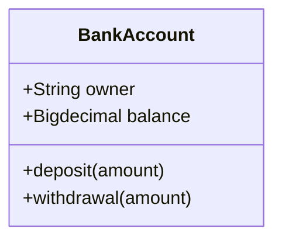
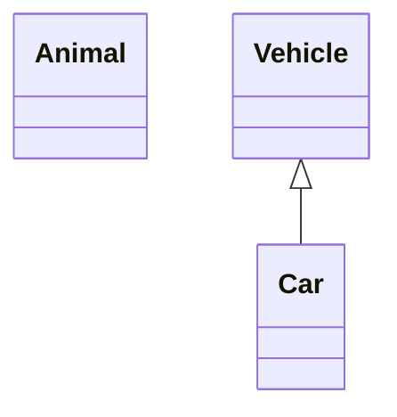
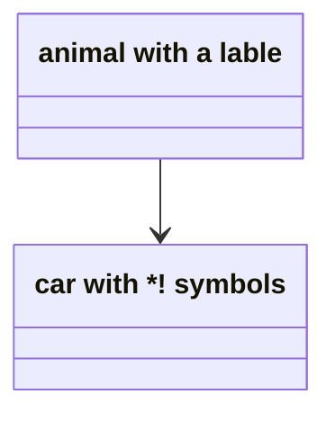
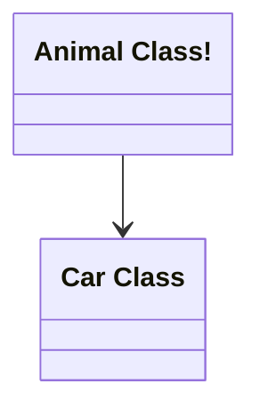
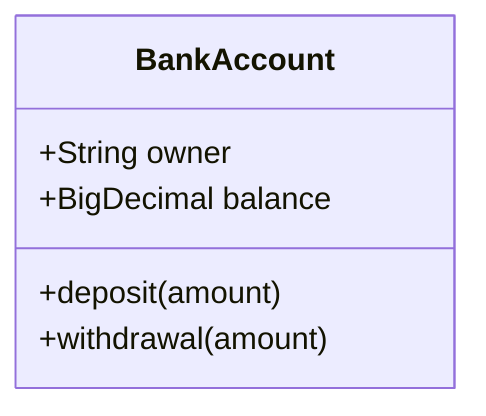
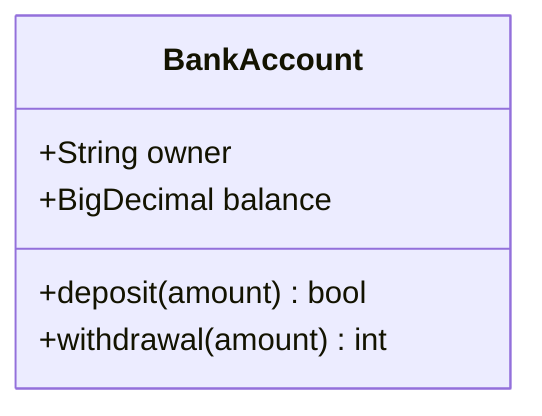
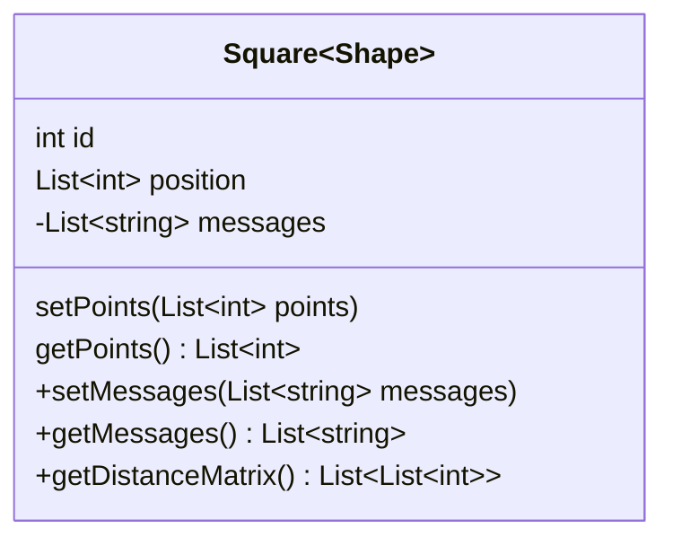

# Flowchart

 

---
title: Bank example
---

```mermaid
classDiagram
    class BankAccount
    BankAccount : +String owner
    BankAccount : +Bigdecimal balance
    BankAccount : +deposit(amount)
    BankAccount : +withdrawal(amount)
```

# Define a class

```mermaid
classDiagram
    class Animal
    Vehicle <|-- Car
```

# class labels

```mermaid
classDiagram
    class Animal["animal with a lable"]
    class Car["car with *! symbols"]
    Animal --> Car
```

backtick ` to escape

```mermaid
classDiagram
    class `Animal Class!`
    class `Car Class`
    `Animal Class!` --> `Car Class`
```

# Defining memebers of a class

```mermaid
classDiagram
    class BankAccount
        BankAccount : +String owner
        BankAccount : +BigDecimal balance
        BankAccount : +deposit(amount)
        BankAccount : +withdrawal(amount)
```

# Defining with code.

```mermaid
classDiagram
    class BankAccount{
        +String owner
        +BigDecimal balance
        +deposit(amount)
        +withdrawal(amount)
    }
```

# Return type

```mermaid
classDiagram
class BankAccount{
    +String owner
    +BigDecimal balance
    +deposit(amount) bool
    +withdrawal(amount) int
}

```

# Genric Type

```mermaid
classDiagram
class Square~Shape~{
    int id
    List~int~ position
    setPoints(List~int~ points)
    getPoints() List~int~
}

Square : -List~string~ messages
Square : +setMessages(List~string~ messages)
Square : +getMessages() List~string~
Square : +getDistanceMatrix() List~List~int~~
```

